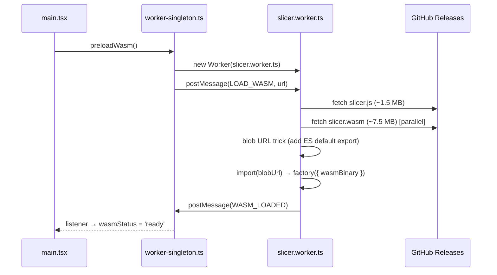

# Architecture

## System diagram

```
┌─────────────────────────────────────────────────────────┐
│                       Browser                            │
│                                                          │
│   main thread                                            │
│   ┌────────────────────────────────────────────────┐    │
│   │  React 19 + TypeScript + Tailwind CSS v4        │    │
│   │                                                │    │
│   │  App.tsx                                       │    │
│   │  ├── FileUpload     drag & drop STL / 3MF      │    │
│   │  ├── ModelViewer    Three.js, real mm scale    │    │
│   │  ├── SettingsPanel  presets + profile import   │    │
│   │  ├── SlicePanel     slice button + download    │    │
│   │  └── GcodeViewer    toolpaths, layer slider    │    │
│   │                                                │    │
│   │  worker-singleton.ts (module-level singleton)  │    │
│   └──────────────────┬─────────────────────────────┘    │
│                      │ postMessage (ArrayBuffer)         │
│   ┌──────────────────▼─────────────────────────────┐    │
│   │  Web Worker: slicer.worker.ts                  │    │
│   │  └── wasm-loader.ts                            │    │
│   │      ├── _orc_init(configJson)                 │    │
│   │      └── _orc_slice(stl) → gcode string        │    │
│   └──────────────────┬─────────────────────────────┘    │
│                      │ fetch                             │
│   ┌──────────────────▼─────────────────────────────┐    │
│   │  GitHub Releases: wasm-v2.3.2                  │    │
│   │  ├── slicer.js    ~1.5 MB  Emscripten glue     │    │
│   │  └── slicer.wasm  ~7.5 MB  OrcaSlicer v2.3.2   │    │
│   └────────────────────────────────────────────────┘    │
└─────────────────────────────────────────────────────────┘
```

No `slicer.data` — the headless flat-config slicer never reads `orca/resources` at runtime, so the 200 MB preload file was eliminated entirely.

## WASM loading sequence



Total cold load: ~9 MB (down from ~152 MB with the old v2.3.1 + slicer.data engine).

## Blob URL trick

Emscripten compiles OrcaSlicer to a CommonJS IIFE (`var OrcaModule = ...`), not an ES module. The worker needs to `import()` it dynamically:

```typescript
const jsText = await fetch(url).then(r => r.text())
const blob = new Blob(
  [`${jsText}\nexport default OrcaModule;`],
  { type: 'application/javascript' },
)
const { default: factory } = await import(URL.createObjectURL(blob))
```

## Singleton worker pattern

React StrictMode mounts components twice in development, which would create two workers and trigger two downloads. The solution: a module-level singleton in `worker-singleton.ts`.

```typescript
let worker: Worker | null = null

export function getWorker(): Worker {
  if (worker) return worker
  worker = new Worker(...)
  worker.postMessage({ type: 'LOAD_WASM', url: wasmUrl })
  return worker
}
```

`preloadWasm()` is called in `main.tsx` before React renders, so WASM loading starts immediately.

## Engine clean layer (override approach)

OrcaSlicer C++ source is never modified. Dependencies unavailable in WASM (OCCT, OpenVDB, OpenCV, Draco, libnoise) are replaced by stub files in `orca-wasm/overrides/`:

```
orca-wasm/
├── overrides/src/libslic3r/
│   ├── Format/STEP.{hpp,cpp}       — no-op (OCCT)
│   ├── Format/DRC.cpp              — no-op (Draco)
│   ├── Format/svg.cpp              — no-op (OCCT)
│   ├── OpenVDBUtils.{hpp,cpp}      — empty header + no-op
│   ├── ObjColorUtils.{hpp,cpp}     — empty header + no-op
│   ├── SLA/Hollowing.cpp           — no-op (OpenVDB)
│   ├── Shape/TextShape.cpp         — no-op (OCCT fonts)
│   └── Feature/FuzzySkin/FuzzySkin.cpp  — no-op (libnoise)
└── patches/apply.py  — injects stubs into CMake, patches CMakeLists + bugfixes
```

Headers that include unavailable system headers (`STEP.hpp`, `OpenVDBUtils.hpp`, `ObjColorUtils.hpp`) are physically copied into the OrcaSlicer source tree by `apply.py` at CI time. The originals are replaced; `overrides/` is the canonical source.

Upgrading to a new OrcaSlicer version: change `ORCA_VERSION` in `build-wasm.yml`, re-run CI. Only signature changes in the overridden functions require stub updates.

## Coordinate systems

| | G-code | Three.js | In app |
|---|---|---|---|
| Horizontal 1 | X | X | X |
| Horizontal 2 | Y | Z | Z |
| Vertical | Z | Y | Y (up) |

**ModelViewer** positions the STL with its bottom face at Y=0, centered on X/Z.

**GcodeViewer** parses G1 extrusion moves and G0/G1 travel moves, computes centroid of all X/Y toolpath points, subtracts it, maps: `gcodeX → x`, `gcodeY → z`, `gcodeZ → y`. Reads OrcaSlicer `;TYPE:` comments to colour extrusion segments by feature type; falls back to a blue→orange height gradient. Rendered with `LineSegments2` + `LineMaterial` for real screen-space line width.

## Data flow

```
File drop
  │
  ▼ File state
ModelViewer ←─ Three.js STLLoader (visual only)

  │ config = buildConfig(printer, filament, preset) + overrides
  │
handleSlice()
  │
  ├─ wasmStatus='ready' ──► worker.postMessage(SLICE, stl, config)
  │
  └─ wasmStatus='loading' ─► pendingSliceRef (queued)
                                  │
                          WASM_LOADED fires
                                  │
                           worker.postMessage(SLICE, ...)
                                  │
                            SLICE_COMPLETE { gcode }
                                  │
                     sliceStatus = { phase:'done', gcode }
                                  │
              ┌───────────────────┴──────────────────────┐
              ▼                                           ▼
        ModelViewer                               GcodeViewer
     (STL, white bg)                          (toolpaths, dark bg)
```

## Build & deploy

=== "Local dev"
    ```bash
    npm run dev       # Vite dev server, WASM from /wasm/
    ```

=== "Production (GitHub Pages)"
    ```bash
    # Triggered automatically on push to master
    # deploy.yml downloads slicer.js + slicer.wasm from release wasm-v2.3.2
    # and embeds them in the gh-pages branch under app/wasm/
    ```

=== "Build WASM engine"
    ```bash
    # GitHub Actions → Build WASM → Run workflow
    # Or: git tag v2.3.2-ow1 && git push --tags
    # Produces: slicer.js (~1.5 MB) + slicer.wasm (~7.5 MB)
    # Published as GitHub Release wasm-v2.3.2
    ```

## Stack

| Layer | Technology | Notes |
|-------|-----------|-------|
| UI | React 19, TypeScript 5 | No React Router — single-page tab state |
| Styling | Tailwind CSS v4 | Custom `orca-*` colour scale |
| 3D | Three.js 0.170 | STLLoader, OrbitControls, LineSegments2 (fat lines) |
| Bundler | Vite 8 | Worker ES format, configurable base |
| WASM | OrcaSlicer **v2.3.2** | Emscripten, single-threaded, self-built |
| Worker | Web Worker (ES module) | Blob URL for dynamic import |
| CLI | Commander + tsx | Node.js, same WASM API |
| License | AGPL-3.0-or-later | Source link in UI footer per §13 |
