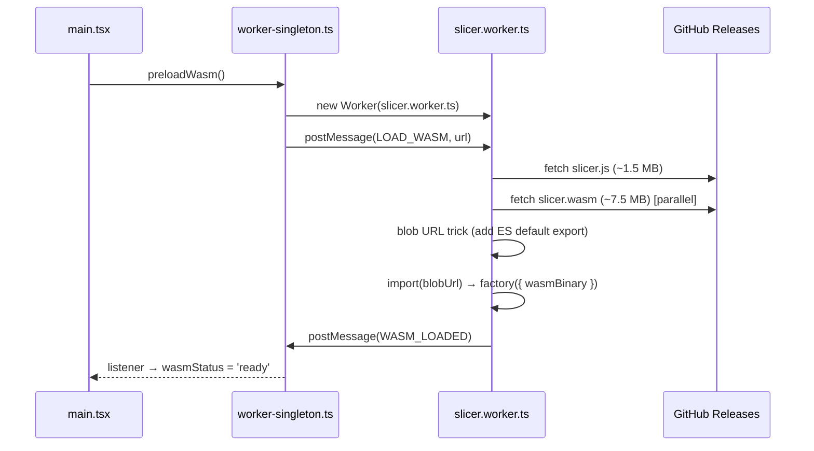

# Architecture

## Project vision

The main product of this repository is the **WASM slicer engine** — OrcaSlicer compiled to WebAssembly with full feature parity (fuzzy skin, infill, supports, all slicer parameters). The goal is a fully working OrcaSlicer that runs without a native binary, usable as a CLI or embedded in any environment that can execute WASM.

The React web UI is a temporary proof-of-concept to demonstrate the engine. It is not the end goal and is not the primary focus of development effort.

## System diagram

```
┌─────────────────────────────────────────────────────────┐
│                       Browser                            │
│                                                          │
│   main thread                                            │
│   ┌────────────────────────────────────────────────┐    │
│   │  React 19 + TypeScript + Tailwind CSS v4        │    │
│   │                                                │    │
│   │  App.tsx                                       │    │
│   │  ├── FileUpload     drag & drop STL/3MF/STEP/OBJ│    │
│   │  ├── ModelViewer    Three.js, real mm scale    │    │
│   │  ├── SettingsPanel  presets + profile import   │    │
│   │  ├── GcodeViewer    toolpaths, layer slider    │    │
│   │  └── (slice UI inline: SliceHeader, QueueItem- │    │
│   │       Card, PlateResultCard, ConfigSummary)    │    │
│   │                                                │    │
│   │  worker-singleton.ts (module-level singleton)  │    │
│   └──────────────────┬─────────────────────────────┘    │
│                      │ postMessage (ArrayBuffer)         │
│   ┌──────────────────▼─────────────────────────────┐    │
│   │  Web Worker: slicer.worker.ts                  │    │
│   │  └── wasm-loader.ts                            │    │
│   │      ├── _orc_init(configJson)                 │    │
│   │      ├── _orc_slice(stl) → gcode string        │    │
│   │      ├── _orc_slice_multi(stls) → gcode string │    │
│   │      ├── _orc_obj_to_stl(obj) → stl bytes      │    │
│   │      └── _orc_cad_to_stl(step/iges) → stl      │    │
│   └──────────────────┬─────────────────────────────┘    │
│                      │ fetch                             │
│   ┌──────────────────▼─────────────────────────────┐    │
│   │  GitHub Releases: wasm-v2.3.2                  │    │
│   │  ├── slicer.js    ~1.5 MB   Emscripten glue     │    │
│   │  └── slicer.wasm  ~16 MB   OrcaSlicer v2.3.2   │    │
│   │                   (incl. OCCT STEP/IGES engine) │    │
│   └────────────────────────────────────────────────┘    │
└─────────────────────────────────────────────────────────┘
```

No `slicer.data` — the headless flat-config slicer never reads `orca/resources` at runtime, so the 200 MB preload file was eliminated entirely.

## WASM loading sequence



Total cold load: ~18 MB (down from ~152 MB with the old v2.3.1 + slicer.data engine). The increase over the original ~9 MB comes from OCCT being compiled directly into `slicer.wasm` — no separate download, no extra WASM file, no third-party dependency.

## Blob URL trick

Emscripten compiles OrcaSlicer to a CommonJS IIFE (`var OrcaModule = ...`), not an ES module. The worker needs to `import()` it dynamically:

```typescript
const jsText = await fetch(url).then(r => r.text())
const blob = new Blob(
  [`${jsText}\nexport default OrcaModule;`],
  { type: 'application/javascript' },
)
const { default: factory } = await import(URL.createObjectURL(blob))
```

## Singleton worker pattern

React StrictMode mounts components twice in development, which would create two workers and trigger two downloads. The solution: a module-level singleton in `worker-singleton.ts`.

```typescript
let worker: Worker | null = null

export function getWorker(): Worker {
  if (worker) return worker
  worker = new Worker(...)
  worker.postMessage({ type: 'LOAD_WASM', url: wasmUrl })
  return worker
}
```

`preloadWasm()` is called in `main.tsx` before React renders, so WASM loading starts immediately.

## Engine clean layer (override approach)

OrcaSlicer C++ source is never modified. The WASM build uses a three-layer strategy to strip out dependencies that are unavailable in a browser:

| Layer | Location | Purpose |
|-------|----------|---------|
| Header shims | `orca-wasm/wasm/shims/` | Replace system library headers (TBB, OpenVDB, FreeType, OpenSSL) with minimal stubs so the compiler sees the right types |
| C++ override stubs | `orca-wasm/overrides/` | Replace OrcaSlicer `.cpp`/`.hpp` files whose implementation depends on missing libraries |
| In-place patches | `orca-wasm/patches/apply.py` | Fix C++ compatibility issues in OrcaSlicer source (narrowing, ABI, platform guards) |

`apply.py` runs before `cmake` and is idempotent. CI applies all three layers automatically.

### Header shims (`orca-wasm/wasm/shims/`)

Added to the compiler search path before all other include paths (`BEFORE PUBLIC` in CMake), so these stubs shadow the real system headers.

#### TBB — sequential stubs

WASM is single-threaded. Every TBB parallel algorithm is replaced by a sequential equivalent that runs in the same thread.

| Shim | Sequential equivalent |
|------|-----------------------|
| `tbb/parallel_for.h` | plain `for` loop |
| `tbb/parallel_for_each.h` | `std::for_each` |
| `tbb/parallel_reduce.h` | sequential iterate + merge |
| `tbb/parallel_invoke.h` | call each functor in order |
| `tbb/parallel_pipeline.h` | sequential `flow_control` / `filter_t` / `make_filter` pipeline |
| `tbb/task_arena.h` | `max_concurrency()` → 1; `execute()` calls functor directly |
| `tbb/task_group.h` | `run()` calls functor immediately; `wait()` is a no-op |
| `tbb/spin_mutex.h` | no-op mutex (single-threaded — no contention possible) |
| `tbb/partitioner.h` | empty `simple/auto/static/affinity_partitioner` types |
| `tbb/global_control.h` | no-op |
| `tbb/concurrent_vector.h` | alias for `std::vector` |
| `tbb/concurrent_unordered_map.h` | alias for `std::unordered_map` |
| `tbb/concurrent_unordered_set.h` | alias for `std::unordered_set` |
| `tbb/blocked_range.h` + `blocked_range2d.h` | lightweight range containers |
| `tbb/tbb.h` | umbrella include — pulls in all of the above |
| `tbb/version.h` | version constants |
| `oneapi/tbb/…` | re-exports → `tbb/…` (same headers, dual include path; also includes `scalable_allocator.h`) |

#### OpenVDB — minimal type stub

`openvdb/openvdb.h` defines only the types referenced by OrcaSlicer headers: `Index32`, `Index64`, `math::Transform`, `initialize()`, and the `math`/`tools`/`util` sub-namespaces. No linking to libopenvdb is needed because the `.cpp` files that would use it are replaced by overrides (see below).

#### FreeType — minimal type stub

`ft2build.h` + `freetype/*.h` provide the types and constants required by `Shape/TextShape.hpp`. The stub is needed because `TextShape.cpp` is compiled as a no-op override and the compiler still needs to parse its header.

#### OpenSSL MD5 — minimal stub

`openssl/md5.h` — minimal stub; MD5 is not used on the FDM slicing path. Emscripten does not bundle OpenSSL.

### C++ override stubs (`orca-wasm/overrides/`)

These replace OrcaSlicer `.cpp` (and some `.hpp`) files whose implementation depends on a library unavailable in WASM. The original files are excluded from compilation; the overrides are compiled in their place. Override `.hpp` headers are physically copied into the OrcaSlicer source tree at CI time so that `#include` from neighbouring files resolves to the stub.

| Override file | Replaces | Missing library | What the stub does |
|--------------|----------|-----------------|--------------------|
| `Format/DRC.cpp` | Draco mesh import | **Draco** | Empty no-op |
| `Format/svg.cpp` | SVG export | **OCCT** | Empty no-op |
| `OpenVDBUtils.cpp` + `OpenVDBUtils.hpp` | VDB volume operations used by FDM infill | **OpenVDB** | Empty header; empty `.cpp` |
| `SLA/Hollowing.cpp` | SLA model hollowing | **OpenVDB** | Empty no-op (SLA not used) |
| `ObjColorUtils.cpp` + `ObjColorUtils.hpp` | OBJ colour calibration | **OpenCV** | Empty header; empty `.cpp` |
| `Shape/TextShape.cpp` | 3D text extrusion | **FreeType** + **OCCT** | Empty no-op |

!!! note "STEP/IGES support — in-engine OCCT"
    OCCT (Open CASCADE Technology 7.8.1) is compiled directly into `slicer.wasm` via `deps/build_occt.sh`. The engine exposes `_orc_cad_to_stl()` which reads STEP or IGES from MEMFS, tessellates the BRep geometry, and returns binary STL bytes.

    - **Browser**: `CAD_TO_STL` message is sent to the slicer worker; the worker calls `_orc_cad_to_stl()` and replies with `CAD_STL_COMPLETE { stl }`.

    No separate OCCT WASM download or third-party library is required.

### libnoise

libnoise (Perlin / Billow / RidgedMulti / Voronoi noise) **is** compiled into the WASM engine and linked normally. `Feature/FuzzySkin/FuzzySkin.cpp` is not stubbed — it is patched in-place by `apply.py`: `thread_local` storage (unsupported by Emscripten in single-threaded mode) is rewritten to `static`, and the seed-fallback expression `std::hash<std::thread::id>()(std::this_thread::get_id())` is replaced with `rd()` (the `std::random_device` already in scope). Fuzzy skin effect is therefore **active** in the engine when `fuzzy_skin ≠ none`.

### Upgrading OrcaSlicer version

Change `ORCA_VERSION` in `build-wasm.yml` and re-run CI. Only changes to the signatures of overridden functions require stub updates.

## Coordinate systems

| | G-code | Three.js | In app |
|---|---|---|---|
| Horizontal 1 | X | X | X |
| Horizontal 2 | Y | Z | Z |
| Vertical | Z | Y | Y (up) |

**ModelViewer** positions the STL with its bottom face at Y=0, centered on X/Z.

**GcodeViewer** parses G1 extrusion moves and G0/G1 travel moves, computes centroid of all X/Y toolpath points, subtracts it, maps: `gcodeX → x`, `gcodeY → z`, `gcodeZ → y`. Reads OrcaSlicer `;TYPE:` comments to colour extrusion segments by feature type; falls back to a blue→orange height gradient. Rendered with `LineSegments2` + `LineMaterial` for real screen-space line width.

## Data flow

```
File drop
  │
  ├─ .stl / .3mf ──► File state
  │                       │
  │               ModelViewer (Three.js STLLoader)
  │
  ├─ .step / .iges ─► worker.postMessage(CAD_TO_STL, cad bytes)
  │                       │
  │               [worker] _orc_cad_to_stl() [OCCT in-engine]
  │                       │
  │               CAD_STL_COMPLETE { stl }
  │                       └─► synthetic .stl File → File state
  │
  └─ .obj ──────────► worker.postMessage(OBJ_TO_STL, obj bytes)
                           │
                   [worker] _orc_obj_to_stl()
                           │
                   OBJ_STL_COMPLETE { stl }
                           └─► synthetic .stl File → File state

  │ config = buildConfig(printer, filament, preset) + overrides
  │
  ├─ Sequential mode (one G-code per file)
  │  handleSliceAll() → startNextSlice() for each ready item
  │      │
  │      └─► worker.postMessage(SLICE, stl, config)
  │               │
  │          SLICE_COMPLETE { gcode }  →  item.status = 'done'
  │          startNextSlice() continues queue
  │
  └─ Plate mode (all files → one G-code)
     handleSlicePlate() → reads all ready stlFiles
         │
         └─► worker.postMessage(SLICE_MULTI, stls[], config)
                  │
             [worker] concatenate + build int32 offset table
                  │
             _orc_slice_multi() → arrange_objects() + slice
                  │
             SLICE_MULTI_COMPLETE { gcode }
                  │
         plateGcode → PlateResultCard (eye / download)
                  │
          ┌───────┴────────┐
          ▼                ▼
    ModelViewer       GcodeViewer
 (STL, white bg)  (toolpaths, dark bg)
```

## Build & deploy

=== "Local dev"
    ```bash
    npm run dev       # Vite dev server, WASM from /wasm/
    ```

=== "Production (GitHub Pages)"
    ```bash
    # Triggered automatically on push to master
    # deploy.yml downloads slicer.js + slicer.wasm from release wasm-v2.3.2
    # and embeds them in the gh-pages branch under app/wasm/
    ```

=== "Build WASM engine"
    ```bash
    # GitHub Actions → Build WASM → Run workflow
    # Or: git tag v2.3.2-ow1 && git push --tags
    # Produces: slicer.js (~1.5 MB) + slicer.wasm (~7.5 MB)
    # Published as GitHub Release wasm-v2.3.2
    ```

## Stack

| Layer | Technology | Notes |
|-------|-----------|-------|
| UI | React 19, TypeScript 5 | No React Router — single-page tab state |
| Styling | Tailwind CSS v4 | Custom `orca-*` colour scale |
| 3D | Three.js 0.170 | STLLoader, OrbitControls, LineSegments2 (fat lines) |
| Bundler | Vite 8 | Worker ES format, configurable base |
| WASM | OrcaSlicer **v2.3.2** | Emscripten, single-threaded, self-built |
| Worker | Web Worker (ES module) | Blob URL for dynamic import |
| License | AGPL-3.0-or-later | Source link in UI footer per §13 |
