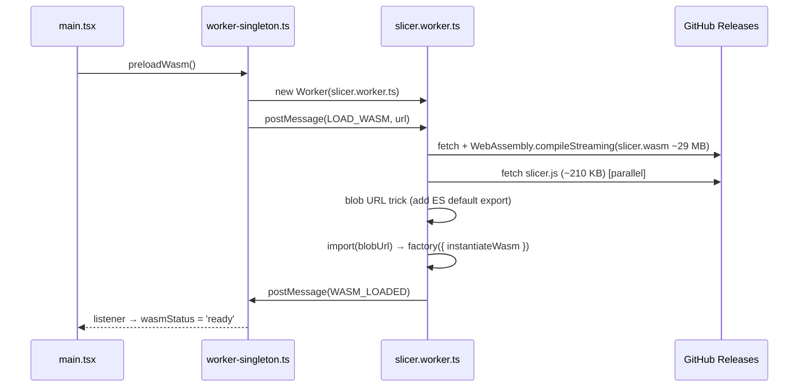

# Architecture

## Project vision

The main product of this repository is the **WASM slicer engine** — OrcaSlicer compiled to WebAssembly with full feature parity (fuzzy skin, infill, supports, all slicer parameters). The goal is a fully working OrcaSlicer that runs without a native binary, embeddable in any environment that can execute WASM. A Node CLI wrapper existed early on and was deliberately removed (`chore: remove CLI` — frontend → bridge → engine only); it is not a project goal.

The React web UI is a temporary proof-of-concept to demonstrate the engine. It is not the end goal and is not the primary focus of development effort.

## System diagram

```
┌─────────────────────────────────────────────────────────┐
│                       Browser                            │
│                                                          │
│   main thread                                            │
│   ┌────────────────────────────────────────────────┐    │
│   │  React 19 + TypeScript + Tailwind CSS v4        │    │
│   │                                                │    │
│   │  App.tsx            layout, tabs, settings     │    │
│   │  ├── FileUpload     drag & drop STL/3MF/STEP/OBJ│    │
│   │  ├── ModelViewer    Three.js, real mm scale    │    │
│   │  ├── SettingsPanel  presets + profile import   │    │
│   │  ├── GcodeViewer    toolpaths, layer slider    │    │
│   │  └── SliceCards     SliceHeader, QueueItemCard,│    │
│   │       PlateResultCard, ConfigSummary           │    │
│   │                                                │    │
│   │  hooks/useSliceQueue.ts (queue state machine:  │    │
│   │    reducer + worker protocol + cancel/stale)   │    │
│   │  worker-singleton.ts (module-level singleton)  │    │
│   └──────────────────┬─────────────────────────────┘    │
│                      │ postMessage (ArrayBuffer)         │
│   ┌──────────────────▼─────────────────────────────┐    │
│   │  Web Worker: slicer.worker.ts                  │    │
│   │  └── wasm-loader.ts                            │    │
│   │      ├── _orc_session_create/destroy()          │    │
│   │      ├── _orc_init(session, configJson)         │    │
│   │      ├── _orc_slice(session, stl) → gcode       │    │
│   │      ├── _orc_slice_multi(session, stls,        │    │
│   │      │       extruderIds) → gcode string        │    │
│   │      ├── _orc_obj_to_stl(obj) → stl bytes      │    │
│   │      └── _orc_cad_to_stl(step) → stl bytes     │    │
│   └──────────────────┬─────────────────────────────┘    │
│                      │ fetch                             │
│   ┌──────────────────▼─────────────────────────────┐    │
│   │  GitHub Releases: wasm-v2.4.2                  │    │
│   │  ├── slicer.js    ~210 KB  Emscripten glue     │    │
│   │  └── slicer.wasm  ~29 MB   OrcaSlicer v2.4.2   │    │
│   │                   (incl. OCCT STEP engine)      │    │
│   └────────────────────────────────────────────────┘    │
└─────────────────────────────────────────────────────────┘
```

No `slicer.data` — the headless flat-config slicer never reads `orca/resources` at runtime, so the 200 MB preload file was eliminated entirely.

## WASM loading sequence



`slicer.wasm` is compiled with `WebAssembly.compileStreaming` while it downloads
(and while `slicer.js` is still being fetched), overlapping download and
compilation; the compiled module is handed to Emscripten through the
`instantiateWasm` hook. When the server mislabels the Content-Type the worker
falls back to buffered `WebAssembly.compile`.

Total cold load: ~29 MB (down from ~152 MB with the old v2.3.1 + slicer.data engine). The increase over the original ~9 MB comes from OCCT being compiled directly into `slicer.wasm` — no separate download, no extra WASM file, no third-party dependency.

## Blob URL trick

Emscripten compiles OrcaSlicer to a CommonJS IIFE (`var OrcaModule = ...`), not an ES module. The worker needs to `import()` it dynamically:

```typescript
const jsText = await fetch(url).then(r => r.text())
const blob = new Blob(
  [`${jsText}\nexport default OrcaModule;`],
  { type: 'application/javascript' },
)
const { default: factory } = await import(URL.createObjectURL(blob))
```

## Singleton worker pattern

React StrictMode mounts components twice in development, which would create two workers and trigger two downloads. The solution: a module-level singleton in `worker-singleton.ts`.

```typescript
let worker: Worker | null = null

export function getWorker(): Worker {
  if (worker) return worker
  worker = new Worker(...)
  worker.postMessage({ type: 'LOAD_WASM', url: wasmUrl })
  return worker
}
```

`preloadWasm()` is called in `main.tsx` before React renders, so WASM loading starts immediately.

## Engine clean layer (override approach)

OrcaSlicer C++ source is never modified. The WASM build uses a three-layer strategy to strip out dependencies that are unavailable in a browser:

| Layer | Location | Purpose |
|-------|----------|---------|
| Header shims | `orca-wasm/wasm/shims/` | Replace system library headers (TBB, OpenVDB, FreeType, OpenSSL) with minimal stubs so the compiler sees the right types |
| C++ override stubs | `orca-wasm/overrides/` | Replace OrcaSlicer `.cpp`/`.hpp` files whose implementation depends on missing libraries |
| In-place patches | `orca-wasm/patches/apply.py` | Fix C++ compatibility issues in OrcaSlicer source (narrowing, ABI, platform guards) |

`apply.py` runs before `cmake` and is idempotent. CI applies all three layers automatically.

### Header shims (`orca-wasm/wasm/shims/`)

Added to the compiler search path before all other include paths (`BEFORE PUBLIC` in CMake), so these stubs shadow the real system headers.

#### TBB — sequential stubs

WASM is single-threaded. Every TBB parallel algorithm is replaced by a sequential equivalent that runs in the same thread.

| Shim | Sequential equivalent |
|------|-----------------------|
| `tbb/parallel_for.h` | plain `for` loop |
| `tbb/parallel_for_each.h` | `std::for_each` |
| `tbb/parallel_reduce.h` | sequential iterate + merge |
| `tbb/parallel_invoke.h` | call each functor in order |
| `tbb/parallel_pipeline.h` | sequential `flow_control` / `filter_t` / `make_filter` pipeline |
| `tbb/task_arena.h` | `max_concurrency()` → 1; `execute()` calls functor directly |
| `tbb/task_group.h` | `run()` calls functor immediately; `wait()` is a no-op |
| `tbb/spin_mutex.h` | no-op mutex (single-threaded — no contention possible) |
| `tbb/partitioner.h` | empty `simple/auto/static/affinity_partitioner` types |
| `tbb/global_control.h` | no-op |
| `tbb/concurrent_vector.h` | alias for `std::vector` |
| `tbb/concurrent_unordered_map.h` | alias for `std::unordered_map` |
| `tbb/concurrent_unordered_set.h` | alias for `std::unordered_set` |
| `tbb/blocked_range.h` + `blocked_range2d.h` | lightweight range containers |
| `tbb/tbb.h` | umbrella include — pulls in all of the above |
| `tbb/version.h` | version constants |
| `oneapi/tbb/…` | re-exports → `tbb/…` (same headers, dual include path; also includes `scalable_allocator.h`) |

#### OpenVDB — minimal type stub

`openvdb/openvdb.h` defines only the types referenced by OrcaSlicer headers: `Index32`, `Index64`, `math::Transform`, `initialize()`, and the `math`/`tools`/`util` sub-namespaces. No linking to libopenvdb is needed because the `.cpp` files that would use it are replaced by overrides (see below).

#### FreeType — minimal type stub

`ft2build.h` + `freetype/*.h` provide the types and constants required by `Shape/TextShape.hpp`. The stub is needed because `TextShape.cpp` is compiled as a no-op override and the compiler still needs to parse its header.

#### OpenSSL MD5 — minimal stub

`openssl/md5.h` — minimal stub; MD5 is not used on the FDM slicing path. Emscripten does not bundle OpenSSL.

### C++ override stubs (`orca-wasm/overrides/`)

These replace OrcaSlicer `.cpp` (and some `.hpp`) files whose implementation depends on a library unavailable in WASM. The original files are excluded from compilation; the overrides are compiled in their place. Override `.hpp` headers are physically copied into the OrcaSlicer source tree at CI time so that `#include` from neighbouring files resolves to the stub.

| Override file | Replaces | Missing library | What the stub does |
|--------------|----------|-----------------|--------------------|
| `Format/DRC.cpp` | Draco mesh import | **Draco** | Empty no-op |
| `Format/svg.cpp` | SVG export | **OCCT** | Empty no-op (SVG export feature unused; not wired to the in-engine OCCT) |
| `OpenVDBUtils.cpp` + `OpenVDBUtils.hpp` | VDB volume operations used by FDM infill | **OpenVDB** | Empty header; empty `.cpp` |
| `SLA/Hollowing.cpp` | SLA model hollowing | **OpenVDB** | Empty no-op (SLA not used) |
| `ObjColorUtils.cpp` + `ObjColorUtils.hpp` | OBJ colour calibration | **OpenCV** | Empty header; empty `.cpp` |
| `Shape/TextShape.cpp` | 3D text extrusion | **FreeType** + **OCCT** | Empty no-op |

!!! note "STEP support — in-engine OCCT"
    OCCT (Open CASCADE Technology 7.8.1) is compiled directly into `slicer.wasm` as part of the dependency build (see `.github/workflows/build-wasm.yml`'s "Build WASM deps — OCCT" step, or `orca-wasm/scripts/build-local-wsl.sh` for local builds). The engine exposes `_orc_cad_to_stl()` which reads a STEP file from MEMFS via OrcaSlicer's `Model::read_from_step()` (which runs `Step::load()` + `Step::mesh()` under the hood), tessellates the BRep geometry, and returns binary STL bytes.

    - **Browser**: `CAD_TO_STL` message is sent to the slicer worker; the worker calls `_orc_cad_to_stl()` and replies with `CAD_STL_COMPLETE { stl }`.

    No separate OCCT WASM download or third-party library is required.

    **IGES is not supported** — OrcaSlicer's STEP reader (`STEPCAFControl_Reader`) does not read IGES, so `.iges`/`.igs` are not accepted by the UI.

### Boost.Log — disabled at runtime

The logging core is disabled outright (`boost::log::core::get()->set_logging_enabled(false)`) by a static initializer in `orca-wasm/bridge/slicer.cpp`. No sink is ever registered in this headless build (the file sink in `utils.cpp` requires `set_logging_file()`, which only the desktop CLI calls), so any record passing the default `warning` filter went to Boost.Log's *default* sink — which, under this single-threaded (`BOOST_LOG_NO_THREADS`) Emscripten build, non-deterministically traps with "memory access out of bounds" in `core::push_record_move()` and is extremely slow. This bit twice: the `nozzle_info.json` incident (a single `BOOST_LOG_TRIVIAL(error)` trapped every slice), and the Voron Design Cube hang — Arachne's per-edge warning storm during Voronoi-diagram repair either trapped mid-slice or spent most of the slice's CPU formatting log records nobody could see, turning a multi-second slice into a multi-minute-plus one.

### libnoise

libnoise (Perlin / Billow / RidgedMulti / Voronoi noise) **is** compiled into the WASM engine and linked normally. `Feature/FuzzySkin/FuzzySkin.cpp` is not stubbed — it is patched in-place by `apply.py`: `thread_local` storage (unsupported by Emscripten in single-threaded mode) is rewritten to `static`, and the seed-fallback expression `std::hash<std::thread::id>()(std::this_thread::get_id())` is replaced with `rd()` (the `std::random_device` already in scope). Fuzzy skin effect is therefore **active** in the engine when `fuzzy_skin ≠ none`.

### Upgrading OrcaSlicer version

Change `ORCA_VERSION` in `build-wasm.yml` and re-run CI. Only changes to the signatures of overridden functions require stub updates.

### Session-scoped engine state

`orca-wasm/bridge/slicer.cpp` scopes the active config, bed geometry, and last
error behind an opaque `orc_session_create()`/`orc_session_destroy()` handle
rather than process-wide C++ statics — see [ADR-008](adr/adr-008-session-handle.md).
`slicer.worker.ts` creates one session right after the module loads and reuses
it for the worker's entire lifetime, so this is behaviour-equivalent to the
old global-state bridge today; it only removes the structural blocker to a
future caller (Node CLI, worker pool) holding more than one session safely in
the same WASM instance.

### Worker crash recovery

If the WASM module aborts at runtime (an unreachable trap, OOM), `onAbort`
reports a `WASM_ERROR` to the main thread and the worker refuses further work
instead of calling into the dead module. `worker-singleton.ts` terminates and
drops that worker on any `WASM_ERROR` (load failure or runtime crash alike);
the next `getWorker()` call spawns a fresh worker and reloads the engine from
scratch, so a mid-session crash is recoverable without a full page reload.
On `WASM_ERROR` the queue (`useSliceQueue`) fails every in-flight item —
the current slice, queued OBJ/STEP conversions, and a running plate slice —
so nothing is left spinning on work the dead worker can no longer deliver.

### Slice queue state machine

`src/hooks/useSliceQueue.ts` owns all queue/slicing state in a single
`useReducer` state machine. Worker responses are correlated explicitly: each
OBJ/STEP conversion carries a `requestId` (the queue item id) echoed back on
the matching `*_COMPLETE`/`*_ERROR`, and single slices are gated by a
`currentId` so only one `SLICE` is ever in flight. A `configEpoch` counter
marks finished results **stale** when the settings change after they were
sliced — the UI flags them and the Slice button becomes *Re-slice*.
User-initiated **cancel** terminates the worker (the synchronous WASM slice
loop cannot be interrupted any other way), re-posts any queued conversions
from their retained source `File`s to the fresh worker, and lets the engine
reload lazily on the next request.

### WASM build smoke test

`build-wasm.yml` runs `orca-wasm/scripts/smoke-test.mjs` after packaging and
before publishing a release — real `orc_init`/`orc_slice(_multi)` calls against
the freshly built engine, not just a successful compile. See
[ADR-009](adr/adr-009-wasm-smoke-test.md).

### E2E UI smoke test

`.github/workflows/e2e-smoke.yml` runs a Playwright test (`e2e/slice.spec.ts`)
against the real UI on every PR: upload the real Voron Design Cube v7 STL
(`e2e/fixtures/voron-design-cube-v7.stl`, vendored under GPL-3.0 — see
`NOTICE.md` — the same model that historically triggered two production
crashes in the Arachne wall generator), slice it through the actual
`FileUpload` → worker → WASM path, and assert the result reaches `Done`.
Downloads the latest *published* engine release rather than building one,
since engine-source correctness is already gated by the WASM build smoke
test above. See [ADR-010](adr/adr-010-e2e-smoke-test.md).

## Coordinate systems

Both viewers use a **Z-up** scene to match the slicer engine — G-code axes map directly to Three.js axes with no permutation.

| | G-code | Three.js | In app |
|---|---|---|---|
| Horizontal 1 | X | X | X |
| Horizontal 2 | Y | Y | Y |
| Vertical | Z | Z | Z (up) |

**ModelViewer** positions the STL with its bottom face at Z=0, centered on X/Y.

**GcodeViewer** parses G1 extrusion moves and G0/G1 travel moves, computes centroid of all X/Y toolpath points, subtracts it, and uses G-code axes directly (`gcodeX → x`, `gcodeY → y`, `gcodeZ → z`). Reads OrcaSlicer `;TYPE:` comments to colour extrusion segments by feature type; falls back to a blue→orange height gradient. Rendered with `LineSegments2` + `LineMaterial` for real screen-space line width.

## Data flow

```
File drop
  │
  ├─ .stl / .3mf ──► File state
  │                       │
  │               ModelViewer (Three.js STLLoader)
  │
  ├─ .step / .stp ──► worker.postMessage(CAD_TO_STL, cad bytes)
  │                       │
  │               [worker] _orc_cad_to_stl() [OCCT in-engine]
  │                       │
  │               CAD_STL_COMPLETE { stl }
  │                       └─► synthetic .stl File → File state
  │
  └─ .obj ──────────► worker.postMessage(OBJ_TO_STL, obj bytes)
                           │
                   [worker] _orc_obj_to_stl()
                           │
                   OBJ_STL_COMPLETE { stl }
                           └─► synthetic .stl File → File state

  │ config = buildConfig(printer, filament, preset) + overrides
  │
  ├─ Sequential mode (one G-code per file)
  │  handleSliceAll() → startNextSlice() for each ready item
  │      │
  │      └─► worker.postMessage(SLICE, stl, config)
  │               │
  │          SLICE_COMPLETE { gcode }  →  item.status = 'done'
  │          startNextSlice() continues queue
  │
  └─ Plate mode (all files → one G-code)
     handleSlicePlate() → reads all ready stlFiles
         │
         └─► worker.postMessage(SLICE_MULTI, stls[], config)
                  │
             [worker] concatenate + build int32 offset table
                  │
             _orc_slice_multi() → arrange_objects() + slice
                  │
             SLICE_MULTI_COMPLETE { gcode }
                  │
         plateGcode → PlateResultCard (eye / download)
                  │
          ┌───────┴────────┐
          ▼                ▼
    ModelViewer       GcodeViewer
 (STL, white bg)  (toolpaths, dark bg)
```

## Build & deploy

=== "Local dev"
    ```bash
    npm run dev       # Vite dev server, WASM from /wasm/
    ```

=== "Production (GitHub Pages)"
    ```bash
    # Triggered automatically on push to master
    # deploy.yml downloads slicer.js + slicer.wasm from release wasm-v2.4.2
    # and embeds them in the gh-pages branch under app/wasm/
    ```

=== "Mirror (Cloudflare Workers)"
    ```bash
    # Cloudflare Workers Builds (Git integration), on push to master
    # Build command:  npm run build:cf   (scripts/cf-build.mjs)
    # Deploy command: npx wrangler deploy   (wrangler.jsonc, static assets)
    #
    # Cloudflare serves only the app shell: slicer.wasm (~36 MB) exceeds
    # the 25 MiB per-asset limit, so cf-build.mjs sets VITE_WASM_BASE_URL
    # to the GitHub Pages copy (served with Access-Control-Allow-Origin: *
    # and Content-Type: application/wasm) and the engine loads cross-origin.
    # The GitHub Pages deploy therefore remains the source of truth for the
    # engine binary — a Cloudflare-only deploy cannot ship a new engine.
    #
    # Cache key + header label come from app/wasm/engine-version.json,
    # published by deploy.yml alongside the wasm files (fallbacks: GitHub
    # Releases API, then the app version — the API is rate-limited from
    # Cloudflare's shared build IPs, so the manifest is the reliable path).
    ```

=== "Build WASM engine"
    ```bash
    # GitHub Actions → Build WASM → Run workflow
    # Or: git tag v2.4.2-ow1 && git push --tags
    # Produces: slicer.js (~210 KB) + slicer.wasm (~29 MB)
    # Runs orca-wasm/scripts/smoke-test.mjs before publishing (ADR-009) —
    # a build that fails the smoke test never reaches the release step
    # Published as GitHub Release wasm-v2.4.2
    ```

## Stack

| Layer | Technology | Notes |
|-------|-----------|-------|
| UI | React 19, TypeScript 6 | No React Router — single-page tab state |
| Styling | Tailwind CSS v4 | Custom `orca-*` colour scale |
| 3D | Three.js 0.184 | STLLoader, OrbitControls, LineSegments2 (fat lines) |
| Bundler | Vite 8 | Worker ES format, configurable base |
| WASM | OrcaSlicer **v2.4.2** | Emscripten, single-threaded, self-built |
| Worker | Web Worker (ES module) | Blob URL for dynamic import |
| License | AGPL-3.0-or-later | Source link in UI footer per §13 |
