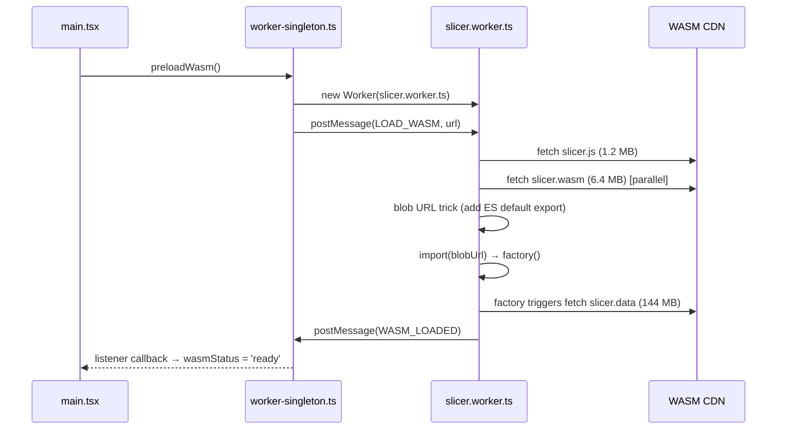

# Architecture

## System diagram

```
┌─────────────────────────────────────────────────────────┐
│                       Browser                            │
│                                                          │
│   main thread                                            │
│   ┌────────────────────────────────────────────────┐    │
│   │  React 18 + TypeScript + Tailwind CSS          │    │
│   │                                                │    │
│   │  App.tsx                                       │    │
│   │  ├── FileUpload     drag & drop STL            │    │
│   │  ├── ModelViewer    Three.js, real mm scale    │    │
│   │  ├── SettingsPanel  presets + profile import   │    │
│   │  ├── SlicePanel     slice button + download    │    │
│   │  └── GcodeViewer    toolpaths, layer slider    │    │
│   │                                                │    │
│   │  worker-singleton.ts (module-level singleton)  │    │
│   └──────────────────┬─────────────────────────────┘    │
│                      │ postMessage (ArrayBuffer)         │
│   ┌──────────────────▼─────────────────────────────┐    │
│   │  Web Worker: slicer.worker.ts                  │    │
│   │  └── wasm-loader.ts                            │    │
│   │      ├── _orc_init(configJson)                 │    │
│   │      └── _orc_slice(stl) → gcode string        │    │
│   └──────────────────┬─────────────────────────────┘    │
│                      │ fetch                             │
│   ┌──────────────────▼─────────────────────────────┐    │
│   │  public/wasm/  (or GitHub Releases in prod)    │    │
│   │  ├── slicer.js    1.2 MB  Emscripten glue      │    │
│   │  ├── slicer.wasm  6.4 MB  OrcaSlicer core      │    │
│   │  └── slicer.data  144 MB  profiles & data      │    │
│   └────────────────────────────────────────────────┘    │
└─────────────────────────────────────────────────────────┘
```

## WASM loading sequence



## Blob URL trick

Emscripten compiles OrcaSlicer to a CommonJS IIFE (`var OrcaModule = ...`), not an ES module. The worker needs to `import()` it dynamically. The trick:

```typescript
const jsText = await fetch(url).then(r => r.text())
const blob = new Blob(
  [`${jsText}\nexport default OrcaModule;`],
  { type: 'application/javascript' },
)
const { default: factory } = await import(URL.createObjectURL(blob))
```

This wraps the IIFE output in a blob URL that browsers treat as a native ES module.

## Singleton worker pattern

React 18 StrictMode mounts components twice in development, which would create two workers and trigger two 144 MB downloads. The solution: a module-level singleton in `worker-singleton.ts`.

```typescript
// Module scope — lives for the entire browser session
let worker: Worker | null = null

export function getWorker(): Worker {
  if (worker) return worker           // already created
  worker = new Worker(...)
  worker.postMessage({ type: 'LOAD_WASM', url: wasmUrl })
  return worker
}
```

`preloadWasm()` is called in `main.tsx` before React renders, so WASM loading starts immediately on page load.

## Coordinate systems

The STL model and G-code toolpaths use the same coordinate system so they visually align in the side-by-side view.

| | G-code | Three.js | In app |
|---|---|---|---|
| Horizontal 1 | X | X | X |
| Horizontal 2 | Y | Z | Z |
| Vertical | Z | Y | Y (up) |

**ModelViewer** positions the STL with its bottom face at Y=0, centered on X/Z.

**GcodeViewer** parses G1 moves, computes the centroid of all X/Y coordinates, subtracts it, then maps: `gcodeX → x`, `gcodeY → z`, `gcodeZ → y`. This centres the toolpaths at the same origin as the model.

## Data flow

```
File drop
  │
  ▼ File state
ModelViewer ←─ Three.js STLLoader (visual only)

  │ config = buildConfig(printer, filament, preset) + overrides
  │
handleSlice()
  │
  ├─ wasmStatus='ready' ──► worker.postMessage(SLICE, stl, config)
  │
  └─ wasmStatus='loading' ─► pendingSliceRef (queued)
                                  │
                          WASM_LOADED fires
                                  │
                           worker.postMessage(SLICE, ...)
                                  │
                            SLICE_COMPLETE { gcode }
                                  │
                     sliceStatus = { phase:'done', gcode }
                                  │
              ┌───────────────────┴──────────────────────┐
              ▼                                           ▼
        ModelViewer                               GcodeViewer
     (STL, white bg)                          (toolpaths, dark bg)
```

## Build & deploy

=== "Local dev"
    ```bash
    npm run dev       # Vite dev server, WASM from /wasm/
    ```

=== "Production (GitHub Pages)"
    ```bash
    VITE_BASE=/OrcaWeb/app/ \
    VITE_WASM_BASE_URL=https://github.com/allanwrench28/orcaslicer-wasm/releases/download/v1.1 \
    npm run build
    # output → dist/
    ```

In production, `VITE_WASM_BASE_URL` points to GitHub Releases. The browser fetches the 144 MB `slicer.data` from `objects.githubusercontent.com` (CORS: `Access-Control-Allow-Origin: *`) and caches it.

## Stack

| Layer | Technology | Notes |
|-------|-----------|-------|
| UI | React 18, TypeScript 5 | No React Router — single-page tab state |
| Styling | Tailwind CSS v3 | Custom `orca-*` colour scale |
| 3D | Three.js 0.170 | STLLoader, OrbitControls, LineSegments |
| Bundler | Vite 5 | Worker ES format, configurable base |
| WASM | OrcaSlicer v2.3.1 | Emscripten, single-threaded |
| Worker | Web Worker (ES module) | Blob URL for dynamic import |
| CLI | Commander + tsx | Node.js, same WASM API |
