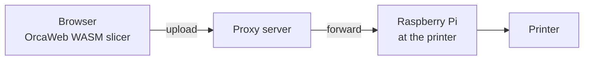

# G-code Compression Benchmark Plan

**Status: planned — not yet executed.** This document defines the methodology; results tables are placeholders to be filled in.

## Motivation

The target pipeline sends slicer output over the network:

G-code is compressed **in the browser** right after slicing, travels through the proxy as opaque bytes, and is decompressed **on the Raspberry Pi**. The primary optimisation target is **bandwidth** (bytes on the wire); browser CPU cost and Pi decompression cost are secondary constraints.

Plain ASCII G-code is extremely redundant (repeated `G1 X.. Y.. E..` tokens, monotonic coordinates, fixed decimal precision), so both domain-specific formats and general-purpose compressors should yield large wins. This benchmark quantifies which combination wins for our pipeline.

## Candidates

### Base formats

| # | Format | Notes |
|---|--------|-------|
| F1 | ASCII G-code | **Baseline.** Output of the OrcaWeb engine as-is |
| F2 | ASCII G-code, comments stripped | Slicer comments are large (`; feature`, config block); strip everything except the header/config needed by the firmware or ship metadata out-of-band |
| F3 | [MeatPack](https://github.com/scottmudge/OctoPrint-MeatPack) | 4-bit packing of the 15 most common G-code characters; used by PrusaLink/OctoPrint; streams trivially |
| F4 | [Prusa Binary G-code](https://github.com/prusa3d/libbgcode) (`.bgcode`) | Block-structured binary container. Per-block compression: `none` / `deflate` / `heatshrink 11,4` / `heatshrink 12,4`; G-code blocks additionally MeatPack-encoded. Test the default profile **and** a variant with internal compression disabled (F4-raw) to allow an external compressor to work on raw blocks |

### General-purpose compressors (applied on top of F1–F4)

| # | Compressor | Levels to test | Browser-side encoder | Pi-side decoder |
|---|-----------|----------------|----------------------|-----------------|
| C1 | gzip (deflate) | 1, 6, 9 | **native** `CompressionStream('gzip')` for the default level (no level parameter in the API, ~6); levels 1/9 via WASM/JS ([fflate](https://github.com/101arrowz/fflate) or pako) and offline | zlib (everywhere) |
| C2 | Brotli | 5, 9, 11 | WASM ([brotli-wasm](https://github.com/httptoolkit/brotli-wasm)) | `brotli` package |
| C3 | Zstandard | 3, 12, 19, 22 (`--ultra`) | WASM ([fzstd/zstd-wasm](https://github.com/OneIdentity/zstd-js) or similar) | `zstd` (apt) |
| C4 | Zstandard + trained dictionary | 19 + 64 KB dict | WASM, dict shipped with the app | `zstd -D` |
| C5 | XZ / LZMA2 (the 7-Zip algorithm) | 6, 9e | WASM ([xz-wasm](https://github.com/SteveSanderson/xz-wasm)) | `xz` (apt) |
| C6 | 7z PPMd | `-m0=PPMd` | *reference only* (no practical browser encoder) | `7zip` (apt) |
| C7 | bzip2 | 9 | *reference only* | bzip2 |

C6/C7 are measured offline for the size table only — they set the "how much is left on the table" bound, not deployment candidates.

### Matrix pruning

The full cross-product is 4 formats × ~15 compressor configs. Prune it:

- **F4 (bgcode with internal heatshrink/deflate) × C1–C5** — expect near-zero gains (already-compressed data); run one config (zstd-19) just to confirm and then drop.
- MeatPack (F3) and bgcode (F4) exist mainly so firmware/MCU can decode them cheaply. Our decoder is a Raspberry Pi running Linux, so they only stay in the race if they *stack* well with a general compressor (F3×C2, F3×C3).
- Main contenders expected: **F1/F2 × C2 (brotli-11), C3 (zstd-19/22), C5 (xz-9e)** vs **F4 default** vs **F4-raw × C3/C5**.

### Domain-specific preprocessing (phase 2, exploratory)

Only worth exploring if general compressors leave a big gap to C6/PPMd:

- **Columnar/token transform** — split the G-code into per-field streams (opcodes, X, Y, Z, E, F values), delta-encode numeric streams, compress each with zstd. This is essentially what makes domain formats win; measure whether it beats brotli-11 by enough to justify a custom format.
- **Arc fitting (G2/G3)** and **coordinate precision** are *slicer settings*, not transport encodings — they change the toolpath itself. Note their effect once (arc fitting on/off on one model) but keep them out of the main comparison; the transport must not alter what gets printed.

## Test corpus

All files generated by the **OrcaWeb engine itself** (pinned WASM build version, pinned profiles), committed as a manifest (model + settings hash), not as raw G-code:

| Model | Purpose | Expected size |
|-------|---------|---------------|
| Calibration cube | small-file overhead / dictionary win | ~100 KB |
| 3DBenchy | canonical mid-size print | ~3–5 MB |
| Voron cube | mixed features (already a repo smoke-test model) | ~1–3 MB |
| Large functional part (e.g. scaled Benchy 250%, supports + 3 walls) | multi-hour print, the case where bandwidth actually hurts | ≥50 MB |
| Spiral vase mode model | long continuous moves, atypical redundancy profile | ~1–2 MB |

Each sliced in **two flavors**: Marlin and Klipper (different verbosity), giving 10 corpus files. `.bgcode` variants exported for the same slices.

## Metrics

1. **Compressed size** (bytes) → ratio vs F1 baseline. *Primary metric.*
2. **Browser compression time & peak memory** — measured inside a Web Worker on a mid-range laptop (Chrome, stable version pinned in the report) for deployable candidates only. Reported as absolute time and as % of the slicing time for the same model.
3. **Pi decompression time & memory** — measured on a Raspberry Pi Zero 2 W (worst case) and Pi 4. Must comfortably beat the print-start latency budget (< 2 s for the 50 MB file, or streamable).
4. **Streamability** — can encoding/decoding run incrementally so upload starts before slicing finishes and printing state doesn't need the whole file in RAM? (gzip/brotli/zstd/xz: yes; bgcode: per-block; 7z container: no.)
5. **Implementation complexity** — native vs WASM in the browser, package availability on the Pi, licensing, extra payload the app must ship (WASM codec size, dictionary size — count these against the first-transfer cost).

## Methodology

- **Phase 0 — corpus generation.** Node script `scripts/generate-corpus.mjs`: reads the committed manifest (model source URL + SHA-256, profile, settings overrides, engine WASM version), downloads the models, and slices them headlessly with the pinned OrcaWeb WASM engine into a local `corpus/` directory (gitignored). `.bgcode` variants are produced from the same G-code with a pinned `libbgcode` build. This makes the corpus fully reproducible from a clean clone without committing tens of MB of G-code.
- **Phase 1 — offline size benchmark.** Node script `scripts/benchmark-gcode-compression.mjs`: takes the `corpus/` directory produced by phase 0, runs every (format × compressor × level) cell via CLI tools (versions pinned in output), emits a markdown results table. Sizes are deterministic — one run each.
- **Phase 2 — browser timing.** Minimal harness page (dev-only route or standalone HTML in `scripts/`) that loads each corpus file, compresses in a Worker with the deployable codecs, reports median of 5 runs.
- **Phase 3 — Pi timing.** Shell script run over SSH on both Pi models; median of 5 runs, `time -v` for peak RSS.
- **Phase 4 — report + decision.** Fill the tables below, write an ADR with the chosen wire format.

Environment (browser version, Node version, CPU, Pi model/OS, tool versions) is recorded at the top of the results.

## Hypotheses

To be confirmed or refuted (ratios from general text-compression experience with G-code-like data):

- gzip at the native default level ≈ 3.5–4:1 (gzip-9 only marginally better) — the floor any candidate must clearly beat, since `CompressionStream('gzip')` is free.
- zstd-19 ≈ 4–4.5:1, brotli-11 ≈ 4.5–5:1, xz-9e ≈ 5:1+.
- bgcode default ≈ 2.5–3:1 — heatshrink is chosen for MCU-friendliness, not ratio; expected to **lose** to F1×brotli-11 on pure bandwidth.
- MeatPack + zstd ≈ zstd alone — bit-packing destroys byte-level patterns the entropy coder would find anyway.
- zstd dictionary only matters for the small-file case (cube), irrelevant ≥1 MB.

## Results

*(to be filled in by phases 1–3)*

### Size (ratio vs ASCII baseline)

| Candidate | cube | Benchy | Voron | large | vase | median ratio |
|-----------|------|--------|-------|-------|------|--------------|
| F1 (baseline, bytes) | | | | | | 1.00 |
| F1 × gzip-9 | | | | | | |
| F1 × brotli-11 | | | | | | |
| F1 × zstd-19 | | | | | | |
| F1 × zstd-22 | | | | | | |
| F1 × xz-9e | | | | | | |
| F2 × brotli-11 | | | | | | |
| F3 × zstd-19 | | | | | | |
| F4 (bgcode default) | | | | | | |
| F4-raw × zstd-19 | | | | | | |
| F1 × 7z-PPMd *(bound)* | | | | | | |

### Browser compression (large file)

| Candidate | time (s) | % of slice time | peak mem | codec payload |
|-----------|----------|-----------------|----------|---------------|

### Pi decompression (large file)

| Candidate | Pi Zero 2 W (s) | Pi 4 (s) | peak RSS |
|-----------|-----------------|----------|----------|

## Decision criteria

Pick the wire format that:

1. achieves the best ratio among candidates whose browser compression adds **< 10 % of slicing time** for the large model,
2. decompresses the large model on a Pi Zero 2 W in **< 2 s** or fully streams,
3. streams end-to-end (upload may begin before slicing completes),
4. needs no custom decoder maintenance on the Pi (apt/pip-installable) unless a custom transform wins by **> 15 %** over the best off-the-shelf option.

Expected outcome (to validate, not assume): **ASCII G-code × brotli-11 or zstd-19** as the wire format, gzip-9 via native `CompressionStream` as the zero-dependency fallback.
