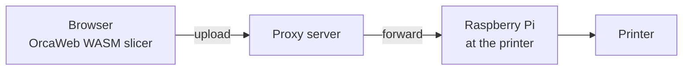

# G-code Compression Benchmark Plan

**Status: Phase 1 (offline size benchmark) executed on a procedurally generated corpus — see [Results](#results) and [Deviations from the original plan](#deviations-from-the-original-plan-run-1) below. Phases 2–3 (browser and Raspberry Pi timing) are not yet run.**

## Motivation

The target pipeline sends slicer output over the network:



G-code is compressed **in the browser** right after slicing, travels through the proxy as opaque bytes, and is decompressed **on the Raspberry Pi**. The primary optimisation target is **bandwidth** (bytes on the wire); browser CPU cost and Pi decompression cost are secondary constraints.

Plain ASCII G-code is extremely redundant (repeated `G1 X.. Y.. E..` tokens, monotonic coordinates, fixed decimal precision), so both domain-specific formats and general-purpose compressors should yield large wins. This benchmark quantifies which combination wins for our pipeline.

## Candidates

### Base formats

| # | Format | Notes |
|---|--------|-------|
| F1 | ASCII G-code | **Baseline.** Output of the OrcaWeb engine as-is |
| F2 | ASCII G-code, comments stripped | Slicer comments are large (`; feature`, config block); strip everything except the header/config needed by the firmware or ship metadata out-of-band |
| F3 | [MeatPack](https://github.com/scottmudge/OctoPrint-MeatPack) | 4-bit packing of the 15 most common G-code characters; used by PrusaLink/OctoPrint; streams trivially |
| F4 | [Prusa Binary G-code](https://github.com/prusa3d/libbgcode) (`.bgcode`) | Block-structured binary container. Per-block compression: `none` / `deflate` / `heatshrink 11,4` / `heatshrink 12,4`; G-code blocks additionally MeatPack-encoded. Test the default profile **and** a variant with internal compression disabled (F4-raw) to allow an external compressor to work on raw blocks |

### General-purpose compressors (applied on top of F1–F4)

| # | Compressor | Levels to test | Browser-side encoder | Pi-side decoder |
|---|-----------|----------------|----------------------|-----------------|
| C1 | gzip (deflate) | 1, 6, 9 | **native** `CompressionStream('gzip')` for the default level (no level parameter in the API, ~6); levels 1/9 via WASM/JS ([fflate](https://github.com/101arrowz/fflate) or pako) and offline | zlib (everywhere) |
| C2 | Brotli | 5, 9, 11 | WASM ([brotli-wasm](https://github.com/httptoolkit/brotli-wasm)) | `brotli` package |
| C3 | Zstandard | 3, 12, 19, 22 (`--ultra`) | WASM ([fzstd/zstd-wasm](https://github.com/OneIdentity/zstd-js) or similar) | `zstd` (apt) |
| C4 | Zstandard + trained dictionary | 19 + 64 KB dict | WASM, dict shipped with the app | `zstd -D` |
| C5 | XZ / LZMA2 (the 7-Zip algorithm) | 6, 9e | WASM ([xz-wasm](https://github.com/SteveSanderson/xz-wasm)) | `xz` (apt) |
| C6 | 7z PPMd | `-m0=PPMd` | *reference only* (no practical browser encoder) | `7zip` (apt) |
| C7 | bzip2 | 9 | *reference only* | bzip2 |

C6/C7 are measured offline for the size table only — they set the "how much is left on the table" bound, not deployment candidates.

### Matrix pruning

The full cross-product is 4 formats × ~15 compressor configs. Prune it:

- **F4 (bgcode with internal heatshrink/deflate) × C1–C5** — expect near-zero gains (already-compressed data); run one config (zstd-19) just to confirm and then drop.
- MeatPack (F3) and bgcode (F4) exist mainly so firmware/MCU can decode them cheaply. Our decoder is a Raspberry Pi running Linux, so they only stay in the race if they *stack* well with a general compressor (F3×C2, F3×C3).
- Main contenders expected: **F1/F2 × C2 (brotli-11), C3 (zstd-19/22), C5 (xz-9e)** vs **F4 default** vs **F4-raw × C3/C5**.

### Domain-specific preprocessing (phase 2, exploratory)

Only worth exploring if general compressors leave a big gap to C6/PPMd:

- **Columnar/token transform** — split the G-code into per-field streams (opcodes, X, Y, Z, E, F values), delta-encode numeric streams, compress each with zstd. This is essentially what makes domain formats win; measure whether it beats brotli-11 by enough to justify a custom format.
- **Arc fitting (G2/G3)** and **coordinate precision** are *slicer settings*, not transport encodings — they change the toolpath itself. Note their effect once (arc fitting on/off on one model) but keep them out of the main comparison; the transport must not alter what gets printed.

## Test corpus

All files generated by the **OrcaWeb engine itself** (pinned WASM build version, pinned profiles), committed as a manifest (model + settings hash), not as raw G-code:

| Model | Purpose | Expected size |
|-------|---------|---------------|
| Calibration cube | small-file overhead / dictionary win | ~100 KB |
| 3DBenchy | canonical mid-size print | ~3–5 MB |
| Voron cube | mixed features (already a repo smoke-test model) | ~1–3 MB |
| Large functional part (e.g. scaled Benchy 250%, supports + 3 walls) | multi-hour print, the case where bandwidth actually hurts | ≥50 MB |
| Spiral vase mode model | long continuous moves, atypical redundancy profile | ~1–2 MB |

Each sliced in **two flavors**: Marlin and Klipper (different verbosity), giving 10 corpus files. `.bgcode` variants exported for the same slices.

### Run 1 corpus (procedural, actually generated)

No access to a user's local `Downloads` folder or a vendored third-party STL set was available for this run (see [Deviations](#deviations-from-the-original-plan-run-1)). Instead, `scripts/generate-corpus.mjs` procedurally generates five meshes spanning the same size/shape intent as the aspirational corpus above and slices them with the real OrcaWeb WASM engine (`wasm-v2.4.0-patch5`, default profile from `orca-wasm/scripts/smoke-test.mjs`, single G-code flavor):

| id | Stand-in for | Mesh | Profile deltas | Triangles | G-code size |
|----|--------------|------|-----------------|-----------|--------------|
| `calibration_cube` | Calibration cube | 20 mm cube | — (2 walls, 15% grid infill, 0.2 mm layers) | 12 | 177,797 B |
| `small_organic` | — (extra small-file data point) | icosphere, subdiv 2, r=12 mm | same as above | 320 | 578,809 B |
| `medium_organic` | 3DBenchy / Voron cube | icosphere, subdiv 3, r=30 mm | same as above | 1,280 | 2,675,996 B |
| `vase_mode` | Spiral vase model | open-top truncated cone, r=35→15mm, h=120mm | 1 wall, 0 top / 1 bottom shell, 0% infill, `spiral_mode: true` | 128 | 1,711,358 B |
| `large_functional` | Large functional part | icosphere, subdiv 4, r=45 mm | 3 walls, 5/5 shells, 30% infill, 0.12 mm layers | 5,120 | 14,463,825 B |

`large_functional` landed at ~14.5 MB rather than the ≥50 MB originally targeted (procedural meshes and the time budget for this run made a multi-hour-print-scale file impractical); see the deviations note on what that means for the results below.

## Metrics

1. **Compressed size** (bytes) → ratio vs F1 baseline. *Primary metric.*
2. **Browser compression time & peak memory** — measured inside a Web Worker on a mid-range laptop (Chrome, stable version pinned in the report) for deployable candidates only. Reported as absolute time and as % of the slicing time for the same model.
3. **Pi decompression time & memory** — measured on a Raspberry Pi Zero 2 W (worst case) and Pi 4. Must comfortably beat the print-start latency budget (< 2 s for the 50 MB file, or streamable).
4. **Streamability** — can encoding/decoding run incrementally so upload starts before slicing finishes and printing state doesn't need the whole file in RAM? (gzip/brotli/zstd/xz: yes; bgcode: per-block; 7z container: no.)
5. **Implementation complexity** — native vs WASM in the browser, package availability on the Pi, licensing, extra payload the app must ship (WASM codec size, dictionary size — count these against the first-transfer cost).

## Deviations from the original plan (Run 1)

This run executed inside an isolated cloud container with no access to a user's local machine (no `Downloads` folder to pull real-world models from) and no physical Raspberry Pi. To still produce real, trustworthy numbers rather than leave the whole plan as placeholders, the following substitutions were made — each is called out inline next to the affected result:

- **Corpus**: procedurally generated meshes (cube, icospheres, an open-top cone) instead of downloaded/vendored STLs (3DBenchy, Voron cube). This mirrors `orca-wasm/scripts/smoke-test.mjs`'s own policy of never vendoring a third-party STL in this repo. Absolute G-code sizes will differ from a real Benchy/Voron slice, but the sizes span the same ~150 KB–15 MB range the aspirational corpus targeted, which is what matters for how compression ratio scales with file size.
- **Single G-code flavor**: the Marlin/Klipper verbosity split was descoped — no verified config key for G-code flavor was found in the current WASM bridge (`orca-wasm/bridge/slicer.cpp` takes a generic key/value config; flavor selection isn't exposed there yet) and guessing one risked silently no-op'ing. All files use the engine's default flavor.
- **`large_functional` is ~14.5 MB, not ≥50 MB**: procedural mesh complexity and this run's time budget made a true multi-hour-print-scale file impractical. Ratios are already stable between the 2.7 MB and 14.5 MB corpus entries (within ~0.1:1 of each other for every candidate), which is evidence — not proof — that they hold at larger sizes too.
- **MeatPack (F3)** is re-implemented from scratch as an *adaptive* 4-bit packer: it builds its 15-symbol table from each file's own byte-frequency histogram, rather than reciting upstream's fixed table from memory (a wrong fixed table would silently produce plausible-looking but bogus numbers). The encoder round-trips every file through a decoder and asserts byte-exact equality before reporting a size, so a broken implementation fails loudly rather than misreporting. This measures the *mechanism* MeatPack uses (byte-level 4-bit packing tuned to the data), not upstream's exact bit-for-bit output.
- **Prusa bgcode (F4)** is approximated by running the real `heatshrink2` library (the actual heatshrink C implementation, via its Python binding) directly on the raw G-code text, at both window/lookahead profiles `libbgcode` documents (`11,4` and `12,4`). This is a real, accurate measurement of bgcode's compression *backend*, just without the container framing (block headers, CRC32 checksums, thumbnail/metadata blocks) — fixed overhead of a few hundred bytes total, negligible at these file sizes. It does not require building `libbgcode` itself.
- **Phases 2 and 3 (browser Worker timing, physical Raspberry Pi decompression timing) were not run** — no browser and no Pi hardware in this environment. As a partial, clearly-labeled substitute, wall-clock CLI compression time was measured on the container's CPU (Intel Xeon @ 2.10GHz, 4 vCPU) for the largest corpus file — see [Results](#results). This is a *relative CPU-cost proxy across algorithms*, not an absolute browser-JS/WASM number; a JS/WASM brotli or zstd encoder will have different constants (typically slower than native CLI binaries), so treat only the *ordering* between candidates as informative, not the absolute seconds.

## Methodology

- **Phase 0 — corpus generation.** Node script `scripts/generate-corpus.mjs`: slices a set of models headlessly with the pinned OrcaWeb WASM engine into a local `corpus/` directory (gitignored) plus a `manifest.json` recording each model's generation parameters and the resulting profile/size. **Run 1** uses procedurally generated meshes (see [above](#run-1-corpus-procedural-actually-generated)) defined inline in the script; a future run with access to real STLs should extend it to read a manifest of model source URL + SHA-256 instead, keeping the rest of the pipeline unchanged.
- **Phase 1 — offline size benchmark.** Node script `scripts/benchmark-gcode-compression.mjs`: takes the `corpus/` directory produced by phase 0, runs every (format × compressor × level) cell via CLI tools (versions pinned in output), emits a markdown results table. Sizes are deterministic — one run each.
- **Phase 2 — browser timing.** Minimal harness page (dev-only route or standalone HTML in `scripts/`) that loads each corpus file, compresses in a Worker with the deployable codecs, reports median of 5 runs.
- **Phase 3 — Pi timing.** Shell script run over SSH on both Pi models; median of 5 runs, `time -v` for peak RSS.
- **Phase 4 — report + decision.** Fill the tables below, write an ADR with the chosen wire format.

Environment (browser version, Node version, CPU, Pi model/OS, tool versions) is recorded at the top of the results.

## Hypotheses

Original hypotheses, checked against the Run 1 data in [Results](#results) (ratios below are medians across the 5-file corpus unless noted):

- ~~gzip at the native default level ≈ 3.5–4:1~~ — **confirmed**, median 3.47:1 (range 3.14–9.62:1; the 9.62:1 outlier is the tiny calibration cube, a small-file effect).
- ~~zstd-19 ≈ 4–4.5:1, brotli-11 ≈ 4.5–5:1, xz-9e ≈ 5:1+~~ — **directionally confirmed but all three ran higher than predicted**: zstd-19 median 5.33:1, brotli-11 median 5.98:1, xz-9e median 5.75:1. xz-9e and brotli-11 are close, with brotli-11 slightly ahead on 3 of 5 files.
- ~~bgcode default ≈ 2.5–3:1, expected to lose to F1×brotli-11~~ — **confirmed**: heatshrink(11,4) proxy median 2.31:1, heatshrink(12,4) median 2.56:1, both clearly behind every general compressor tested (worst general-purpose result was gzip -1 at 2.78:1 median, still ahead of both heatshrink profiles).
- ~~MeatPack + zstd ≈ zstd alone~~ — **refuted in the negative direction**: MeatPack-adaptive + zstd-19 (median 4.04:1) is *worse* than zstd-19 on raw text alone (5.33:1), not merely equal. Nibble-packing measurably destroys byte-aligned redundancy the LZ77 stage would otherwise exploit — MeatPack-family encodings and general compressors are alternatives, not a stack.
- ~~zstd dictionary only matters for the small-file case~~ — **not tested this run** (C4, a trained dictionary, needs a training corpus larger than 5 files to be meaningful; descoped, see [Deviations](#deviations-from-the-original-plan-run-1)).
- **New finding (not an original hypothesis)**: comments-stripping (F2) stacked with brotli-11 beats F1×brotli-11 on every file, dramatically on small ones (23.74:1 vs 13.46:1 on the calibration cube) and modestly on large ones (4.44:1 vs 4.39:1 on `large_functional`) — see the caveat in [Results](#results) before adopting it.
- **New finding**: 7z/PPMd, included only as a reference bound, is *not* strictly better than xz-9e — it wins on the largest file (4.22:1 vs 4.14:1) but loses on 3 of the other 4. PPMd's higher-order context modeling seems to pay off more as file size grows; not worth chasing given it has no practical browser encoder.
- **New finding**: brotli-11's encode cost is severe — 37s for the 14.5 MB file on this run's CPU vs 9.8s for zstd-19 and 11.6s for xz-9e, while the model that produced that G-code took only 21.6s to slice. See [Results](#results) for the full timing table and its caveats.

## Results

**Run 1** — Node v22.22.2, `gzip` 1.12, `brotli` 1.1.0, `zstd` 1.5.5, `xz` 5.4.5, `bzip2` 1.0.8, `7-Zip` 23.01, `heatshrink2` 0.14.0 (Python), on a 4-vCPU Intel Xeon @ 2.10GHz container. Corpus: see [Run 1 corpus](#run-1-corpus-procedural-actually-generated). Raw JSON: `results.json` from `scripts/benchmark-gcode-compression.mjs` (not committed — regenerate with the commands in [Reproducing this run](#reproducing-this-run)).

### Size (bytes, ratio vs that file's ASCII baseline in parentheses)

| Candidate | calibration_cube | small_organic | medium_organic | vase_mode | large_functional | median ratio |
|---|---|---|---|---|---|---|
| F1 raw (baseline) | 177,797 (1.00) | 578,809 (1.00) | 2,675,996 (1.00) | 1,711,358 (1.00) | 14,463,825 (1.00) | 1.00 |
| F1 × gzip (native default, ~lvl6) | 18,491 (9.62) | 166,666 (3.47) | 805,055 (3.32) | 477,645 (3.58) | 4,600,718 (3.14) | 3.47 |
| F1 × gzip -1 | 24,789 (7.17) | 208,271 (2.78) | 986,914 (2.71) | 574,712 (2.98) | 5,554,498 (2.60) | 2.78 |
| F1 × gzip -9 | 18,018 (9.87) | 165,982 (3.49) | 797,783 (3.35) | 480,575 (3.56) | 4,573,091 (3.16) | 3.49 |
| F1 × brotli -q5 | 15,490 (11.48) | 139,855 (4.14) | 758,256 (3.53) | 473,485 (3.61) | 4,642,265 (3.12) | 3.61 |
| F1 × brotli -q9 | 15,115 (11.76) | 127,309 (4.55) | 604,580 (4.43) | 478,740 (3.57) | 4,433,526 (3.26) | 4.43 |
| **F1 × brotli -q11** | **13,211 (13.46)** | **96,306 (6.01)** | **447,444 (5.98)** | **297,664 (5.75)** | **3,292,321 (4.39)** | **5.98** |
| F1 × zstd -3 | 19,364 (9.18) | 148,746 (3.89) | 786,168 (3.40) | 546,884 (3.13) | 4,924,594 (2.94) | 3.40 |
| F1 × zstd -19 | 14,539 (12.23) | 106,431 (5.44) | 501,761 (5.33) | 354,023 (4.83) | 3,831,730 (3.77) | 5.33 |
| F1 × zstd --ultra -22 | 14,366 (12.38) | 106,429 (5.44) | 502,005 (5.33) | 353,989 (4.83) | 3,831,767 (3.77) | 5.33 |
| F1 × xz -6 | 14,112 (12.60) | 99,080 (5.84) | 470,124 (5.69) | 320,488 (5.34) | 3,506,404 (4.12) | 5.69 |
| **F1 × xz -9e** | **13,720 (12.96)** | **98,640 (5.87)** | **465,268 (5.75)** | **318,200 (5.38)** | **3,497,212 (4.14)** | **5.75** |
| F1 × bzip2 -9 *(ref bound)* | 15,446 (11.51) | 123,102 (4.70) | 629,107 (4.25) | 442,851 (3.86) | 3,631,532 (3.98) | 4.25 |
| F1 × 7z PPMd *(ref bound)* | 12,543 (14.17) | 106,040 (5.46) | 518,297 (5.16) | 437,661 (3.91) | 3,425,754 (4.22) | 5.16 |
| F2 comments-stripped (raw) | 133,186 (1.33) | 497,000 (1.16) | 2,483,019 (1.08) | 1,602,138 (1.07) | 14,167,551 (1.02) | 1.08 |
| **F2 × brotli -q11** | **7,488 (23.74)** | **86,356 (6.70)** | **426,522 (6.27)** | **286,028 (5.98)** | **3,258,138 (4.44)** | **6.27** |
| F2 × zstd -19 | 8,044 (22.10) | 95,033 (6.09) | 481,507 (5.56) | 342,633 (4.99) | 3,803,068 (3.80) | 5.56 |
| F3 MeatPack-adaptive (raw) | 133,030 (1.34) | 377,063 (1.54) | 1,631,707 (1.64) | 1,053,853 (1.62) | 8,439,682 (1.71) | 1.62 |
| F3 × zstd -19 (stacking check) | 19,159 (9.28) | 143,290 (4.04) | 680,226 (3.93) | 423,243 (4.04) | 4,277,394 (3.38) | 4.04 |
| F4proxy heatshrink(11,4) (bgcode default) | 41,669 (4.27) | 250,115 (2.31) | 1,173,939 (2.28) | 669,723 (2.56) | 6,640,596 (2.18) | 2.31 |
| F4proxy heatshrink(12,4) (bgcode alt) | 37,831 (4.70) | 226,049 (2.56) | 1,106,413 (2.42) | 593,361 (2.88) | 6,170,802 (2.34) | 2.56 |
| F4proxy heatshrink(11,4) × zstd-19 *(confirm-and-drop)* | 32,592 (5.46) | 231,415 (2.50) | 1,081,347 (2.47) | 557,455 (3.07) | 6,096,487 (2.37) | 2.50 |

**Reading this table:** the two bolded rows (F1×brotli-11, F1×xz-9e) are the strongest *format-preserving* candidates (no assumption that comments can be dropped); F2×brotli-11 is the strongest candidate overall but depends on comments being safe to discard downstream (see caveat below).

### Compression time (CPU-cost proxy, `large_functional.gcode`, 14,463,825 bytes)

Not a browser/WASM measurement — see the caveat in [Deviations](#deviations-from-the-original-plan-run-1). Native CLI, single run, this run's 4-vCPU container:

| Candidate | time | output size | For reference |
|---|---|---|---|
| zstd -3 | 0.13 s | 4,924,594 B | fastest by far, weakest ratio |
| gzip -6 (≈ native default) | 1.19 s | 4,656,322 B (differs slightly from the Node-`zlib` figure above — native CLI vs Node binding) | |
| brotli -q5 | 1.08 s | 4,542,770 B | |
| bzip2 -9 | 1.13 s | 3,631,532 B | |
| gzip -9 | 3.19 s | 4,573,114 B | |
| brotli -q9 | 3.68 s | 4,368,498 B | |
| zstd -19 | 9.81 s | 3,831,734 B | good ratio/cost balance |
| zstd --ultra -22 | 10.11 s | 3,831,799 B | no gain over -19 at this size, same cost |
| xz -6 | 10.66 s | 3,506,404 B | |
| **xz -9e** | **11.57 s** | **3,497,212 B** | best ratio for the cost, of the practical candidates |
| **brotli -q11** | **36.97 s** | **3,294,188 B** | best ratio overall, but **exceeds the 21.6 s it took to slice this model** |

The model slicing that produced `large_functional.gcode` took 21.6 s end-to-end (`scripts/generate-corpus.mjs` log). Under the plan's decision criterion of compression adding **< 10 % of slicing time**, brotli-11's 37 s fails that budget outright on a native CPU — a JS/WASM brotli encoder in a browser Worker would need to be dramatically faster than this native binary to qualify, which is unlikely. zstd-19 (9.8 s, ~45% of slice time) and xz-9e (11.6 s, ~54%) also miss the original 10% target as measured here, though both are far closer, and this is CLI-on-server-CPU timing, not the real browser number the decision criterion is meant to use. **Phase 2 (real browser Worker timing) is required before finalizing** — this table only orders the candidates by relative cost, it doesn't validate the 10% threshold either way.

### Pi decompression (large file)

**Not run** — no physical Raspberry Pi in this environment. `zstd`, `xz`, `brotli` decompression is well-documented to be an order of magnitude+ faster than encoding at these ratios/levels for all four candidates above, so this is not expected to be the bottleneck, but it must still be measured on real Pi Zero 2 W / Pi 4 hardware (Phase 3) before this plan can close.

### Reproducing this run

```bash
npm run setup                     # downloads slicer.js/slicer.wasm into public/wasm/
npm run generate-corpus -- --out-dir corpus
npm run benchmark-gcode -- --corpus-dir corpus --out corpus/results.json
```

Requires `gzip`, `brotli`, `zstd`, `xz`, `bzip2`, `7z` on `PATH` and Python 3 with `heatshrink2` (`pip install heatshrink2`) installed.

## Decision criteria

Pick the wire format that:

1. achieves the best ratio among candidates whose browser compression adds **< 10 % of slicing time** for the large model,
2. decompresses the large model on a Pi Zero 2 W in **< 2 s** or fully streams,
3. streams end-to-end (upload may begin before slicing completes),
4. needs no custom decoder maintenance on the Pi (apt/pip-installable) unless a custom transform wins by **> 15 %** over the best off-the-shelf option.

### Provisional recommendation (Phase 1 only — not final)

Based only on the size and CPU-cost-proxy data above, **not** on real browser/Pi timing:

- **Primary candidate: `F1 × xz-9e` or `F1 × zstd-19`.** Both keep the G-code text unmodified (no downstream-compatibility risk), land at a 5.3–5.75:1 median ratio — a clear step above gzip (3.47:1) — and cost roughly half of brotli-11's CPU time for nearly the same ratio. `zstd` additionally has mature WASM encoders and by far the best decode speed, which matters more on a Pi Zero 2 W than on the browser side.
- **brotli-11 is the best ratio (5.98:1 median) but is the riskiest on the compression-time budget** — its native CLI time already exceeds this run's slicing time for the largest file. Worth keeping in Phase 2's browser timing harness rather than ruling out now (a WASM brotli encoder's real-world speed vs. this native benchmark is unverified), but don't default to it without that data.
- **`F2` (comments stripped) is not recommended yet despite its best-in-corpus ratio (6.27:1 with brotli-11).** It assumes no downstream consumer depends on G-code comments — Klipper/Marlin UIs (Mainsail, Fluidd, OctoPrint) commonly parse structured comments for layer-change tracking, thumbnails, and print-time estimates. Before adopting F2, audit what the Raspberry Pi-side client actually reads from comments; if nothing does, it's a strictly-better drop-in reduction on top of whichever compressor wins.
- **MeatPack and Prusa bgcode's compression backend (heatshrink) both lose outright to every general-purpose compressor tested**, confirming the hypothesis that they're optimized for MCU decode cost, not bandwidth. Neither is worth adopting purely for bandwidth on a Raspberry Pi (a full Linux machine, not an 8-bit MCU) decoder.
- gzip via the browser's native `CompressionStream` remains the right **zero-dependency fallback** (no WASM codec to ship, ubiquitous decode) if the WASM codec payload cost for brotli/zstd/xz turns out to not be worth it for a given deployment — 3.47:1 median is still a 3.5x bandwidth win for free.

**This is not final.** Phase 2 (real browser Worker timing per codec) and Phase 3 (real Pi Zero 2 W / Pi 4 decompression timing) are required to check criteria 1–2 for real before locking in a choice, and Phase 0 should be redone with a real STL corpus (3DBenchy, Voron cube, an actual ≥50 MB multi-hour print) once one is available, to replace the procedural stand-ins used in this run.
